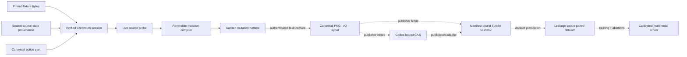

# ImpactDiff

[](https://github.com/omar07ibrahim/impactdiff/actions/workflows/ci.yml)

ImpactDiff is a research lab for task-aware visual regression detection. A pixel diff
can show that a page changed; this project asks whether the change breaks a user task,
damages accessibility, and which visible or structural evidence supports that
conclusion.

The planned benchmark input is a matched before/after capture containing screenshots,
accessibility trees, bounded layout graphs, and a fixed action plan. The intended model
output is a calibrated regression score, severity, the affected UI node and region, and
an evidence trail back to the failed task step.

## Current status

The repository contains an executable evidence boundary and the deterministic core of
the capture/mutation pipeline. It does **not** yet contain a released dataset, trained
model, or benchmark result, and makes no accuracy claim.

Implemented today:

- four closed dataset-manifest schemas with strict canonical JSON, content-derived
  identities, visible/sealed binding, and leakage-aware split validation;
- a registered-codec content-addressed store that canonicalizes on write, revalidates on
  read and audit, and enforces exact membership, plus a paired audit that keeps visible
  and sealed roots disjoint;
- bounded canonical PNG decoding and deterministic RGBA re-encoding, including removal
  of ancillary metadata and invisible-RGB channels;
- closed action-plan, capture-specification, accessibility, and layout payloads, plus
  deterministic accessibility/layout normalization and Q64 geometry;
- resolved evidence/intervention validators that bind every supplied payload to its
  manifest reference, checkpoint schedule, viewport, graph links, and sealed mutation
  provenance;
- a typed, reversible mutation compiler for a contrast-safe palette swap and a pointer
  interceptor expected to break the task, with source probes and derived preconditions;
  and
- a verified Chromium mutation session over a deterministic checkout fixture. It binds
  exact action-plan bytes, fixture resources, reported browser version, CSP, virtual
  time, network policy, DOM/CSS integrity, and exact mutation cleanup. Its authenticated
  task executor derives and locks deterministic scroll/target geometry, performs a true
  coordinate click, then emits two canonical PNG, accessibility-tree, and layout-graph
  checkpoints without exposing a partial run.

The capture contract names the exact installed file trees for `@playwright/test`,
`playwright`, and `playwright-core` 1.61.1; the Chromium Headless Shell executable,
complete installation tree, source revision, and normalized launch profile; every
render-font file; and either an honest Linux host or an externally verified OCI subject.
The verified single-role capture path and mutation runtime are implemented; assembling
baseline and candidate roles into one audited publication is still pending. Learned
baselines come only after that path is auditable end to end.

## Architecture

Solid arrows are implemented and tested. Dashed arrows are the remaining research
pipeline, not a claim about shipped data or models.



## Research question

Can a model that aligns pixels with accessibility and interaction evidence distinguish
task-breaking changes from benign redesigns better than screenshot, tree, or DOM diffing
alone when both the application and mutation family are held out?

ImpactDiff will test that question with paired interventions. Each source state will be
rendered both unchanged and under a controlled mutation. Mutation metadata will be
retained for scoring and audit but excluded from model features. Scripted task outcomes
will provide the primary severity signal.

## Intended evidence bundle

Each benchmark item will contain:

- fixed-environment before and after screenshots;
- normalized accessibility snapshots;
- a bounded graph of visible DOM nodes and layout relations;
- a deterministic action plan shared by both captures;
- content hashes and capture-environment provenance; and
- separately sealed traces, oracle results, mutation provenance, and labels.

The current compiler deliberately starts with two operators: a benign, contrast-checked
palette swap and a pointer interceptor expected to break the primary click task. A
larger benchmark mutation set is planned to cover occlusion, clipping, focus order,
accessible names, responsive collapse, safe reflow, copy edits, and other controlled
changes. An operator's declared task relation is provenance, not a measured label;
labels must still come from execution outcomes.

## Evaluation plan

The benchmark will use application-disjoint and mutation-family-disjoint test sets.
Planned comparisons include pixel distance, SSIM, DOM-tree distance, screenshot-only
models, accessibility-only models, and a fused multimodal model. Detection,
localization, severity, calibration, and false-positive rate on benign redesigns will be
reported separately.

See [the research charter](docs/charter.md) for hypotheses, metrics, falsification
criteria, and non-goals. The [data-boundary contract](docs/data-boundary.md) separates
model-visible evidence from outcomes and mutation metadata. The
[contract invariants](docs/contract-invariants.md) document canonical payloads, resolved
artifact checks, and the v1 artifact-store threat boundary.

## Repository map

- `src/contracts/` — visible/sealed manifests, identities, resolved bundles, and dataset
  validation;
- `src/artifacts/` — canonical PNG handling and the registered-codec artifact store;
- `src/capture/` — capture payload schemas, validators, normalizers, and stable fixture
  target identities;
- `src/mutations/` — mutation identities, sealed plans, compiler, and verified Chromium
  runtime; and
- `fixtures/checkout-card-v1/` — the deterministic local checkout state for pinned
  capture tests.

The fixture vendors the Latin variable WOFF2 from
`@fontsource-variable/noto-sans@5.2.10`. Noto Sans remains licensed under the SIL Open
Font License 1.1; the [bundled license](fixtures/checkout-card-v1/fonts/OFL-1.1.txt) is
kept beside the font.

## Development

ImpactDiff requires Node.js 22 or newer. Install the locked dependencies and the pinned
browser, then run the same verification used in CI:

```bash
npm ci
npx playwright install chromium
npm run format:check
npm run check
npm test
```

On a fresh Linux runner, Playwright may also need its distribution packages; CI installs
them with `npx playwright install --with-deps chromium`. `npm run coverage` executes the
same suite with Node's source-coverage report.

## Engineering constraints

- The data generator and capture path must run without paid APIs.
- Browser, fonts, locale, viewport, timezone, animation, and time are pinned or
  recorded.
- Supported artifacts are content-addressed, codec-canonical, and independently
  verifiable.
- Training is CPU-capable at development scale; larger optional runs must not be
  required to validate the pipeline.
- Evidence and labels come from executable state checks, not free-form model judgments.

## License

Apache-2.0. See [LICENSE](LICENSE).
