# ImpactDiff

[](https://github.com/omar07ibrahim/impactdiff/actions/workflows/ci.yml)

ImpactDiff is a research lab for task-aware visual regression detection. A pixel diff
can show that a page changed; this project asks whether the change breaks a user task,
damages accessibility, and which visible or structural evidence supports that
conclusion.

The planned benchmark input is a matched before/after capture containing screenshots,
accessibility trees, bounded layout graphs, and a fixed action plan. Pilot v0.1 narrows
the learned task to a calibrated binary task-regression score. Ordinal severity and
learned localization remain later research questions rather than promised outputs.

## Current status

The repository contains an executable evidence boundary and the deterministic core of
the capture/mutation pipeline. It does **not** yet contain a released dataset, trained
model, or benchmark result, and makes no accuracy claim.

Implemented today:

- a machine-validated Pilot v0.1 protocol frozen before corpus outcomes: 20 application
  keys, two workflows per application, eight causal mutation families, paired breaking
  and preserving relations, four application-disjoint outer folds, exact metrics, and
  explicit claim gates;
- a content-addressed Pilot operator catalog with 16 exact definitions. Each definition
  binds typed effects, source and installed probes, inverse/cleanup requirements, and an
  ordered eight-predicate causal policy that distinguishes designated, correlated, and
  preserved effects;
- four closed dataset-manifest schemas with strict canonical JSON, content-derived
  identities, visible/sealed binding, and leakage-aware split validation;
- a registered-codec content-addressed store that canonicalizes on write, revalidates on
  read and audit, and enforces exact membership, plus a paired audit that keeps visible
  and sealed roots disjoint;
- bounded canonical PNG decoding and deterministic RGBA re-encoding, including removal
  of ancillary metadata and invisible-RGB channels;
- closed action-plan, capture-specification, accessibility, and layout payloads, plus
  deterministic accessibility/layout normalization and Q64 geometry;
- resolved evidence/intervention validators that bind every supplied payload to its
  manifest reference, checkpoint schedule, viewport, graph links, and sealed mutation
  provenance;
- closed changed-surface, executable-oracle, raw-trace, and localization payloads, plus
  resolved-record replay that derives outcomes from captured task state instead of
  trusting stored labels;
- a typed, reversible mutation compiler for a contrast-safe palette swap and a pointer
  interceptor expected to break the task, with source probes and derived preconditions;
- a runtime-owned Chromium mutation environment over a deterministic checkout fixture.
  It derives environment identity from canonical CaptureSpec bytes that bind installed
  Playwright and browser trees, the project-pinned live executable and launch profile,
  declared font bytes, and capture settings. The session separately verifies fixture
  resources, CSP, actual custom-font use, virtual time, network policy, DOM/CSS
  integrity, and exact mutation cleanup. Its authenticated task executor derives and
  locks deterministic scroll/target geometry, performs a true coordinate click, then
  emits two canonical PNG, accessibility-tree, and layout-graph checkpoints without
  exposing a partial run;
- a fixed fresh-pair assembler for `checkout-card-v1`. It commits replicate zero before
  execution, runs baseline and candidate sequentially in distinct browser contexts under
  one verified Chromium environment, requires cleanup, audited session closes, an empty
  blocked-external-request audit, and browser shutdown, then derives and replays the
  complete pair before publication; and
- an append-only paired-release publisher. It snapshots caller bytes before its first
  asynchronous operation, builds independent visible and sealed CAS roots in one private
  staging directory, verifies exact topology and full semantic replay, writes a commit
  binding both canonical records, and exposes the pair with one same-parent directory
  rename. Startup recovers only reserved owned stages; committed releases are idempotent
  and immutable; and
- the first pre-release Pilot authoring package, `pilot-market-basket-v1`. Its strict
  manifest binds an independently designed 800 by 600 Thread & Tally UI, two four-action
  workflows, the shared mutation ABI, exact resource provenance, a canonical
  SourceState, and two derived ActionPlans without creating identity cycles. The loader
  is deliberately `official: false` and has no outcome, capture, or label surface; and
- a separate Pilot browser-authoring runtime for that package. It snapshots the audited
  fixture bytes before launch, binds them to the pinned Chromium and CaptureSpec, and
  replays either workflow in a fresh isolated context. The replay closes request, CSP,
  WebRTC, shadow-root, custom-font, readiness, ABI, action, bounded live-document, and
  lifecycle audits around a raw source-center click, then returns only a success audit
  marked `official: false`. It attests reviewed, repository-authored fixture code rather
  than hostile page code. It does not run mutation operators, collect
  PNG/accessibility/layout modalities, derive outcomes or labels, create a generation
  plan, or publish a benchmark row.

The capture contract names the exact installed file trees for `@playwright/test`,
`playwright`, and `playwright-core` 1.61.1; the Chromium Headless Shell executable,
complete installation tree, source revision, and normalized launch profile; every
render-font file; and an honest Linux host or an OCI shape reserved for external
attestation verification. The current launcher produces a host capability only. The
verified single-role runtime, fixed fresh-pair assembler, and paired-release transaction
are implemented for the closed checkout fixture. Real-browser integration covers the
task-breaking pointer interceptor and task-preserving palette swap. This is a
development path, not a corpus generator: multi-pair dataset construction,
process-isolated feature loading, general scoring, training, and learned baselines
remain future work.

## Architecture

Solid arrows are implemented and tested. Dashed arrows are the remaining research
pipeline, not a claim about shipped data or models.

```mermaid
flowchart LR
  fixture["Pinned fixture bytes"] --> environment["Owned capture environment"]
  environment -->|"branded browser + CaptureSpec"| session["Verified Chromium session"]
  source["Sealed source-state provenance"] --> session
  actions["Canonical action plan"] --> session
  session --> probe["Live source probe"]
  probe --> compiler["Reversible mutation compiler"]
  compiler --> runtime["Audited mutation runtime"]

  modalities["Canonical PNG · AX · layout"] --> assembler["Fresh-pair assembler"]
  assembler -->|derive + replay complete pair| publisher["Atomic paired publisher"]
  publisher -->|exact visible + sealed membership| cas["Codec-bound CAS"]
  publisher -->|replay before + after rename| resolver["Manifest-bound bundle validator"]

  runtime -->|authenticated task capture| modalities
  resolver -.->|dataset publication| dataset["Leakage-aware paired dataset"]
  dataset -.->|training + ablations| models["Calibrated multimodal scorer"]
```



## Research question

On application-disjoint synthetic workflows, can a model that combines pixel and
structured accessibility/layout evidence detect task-breaking changes better than both
learned unimodal baselines? The comparison is supported only when the lower bound of a
paired 95% application-cluster bootstrap interval for each average-precision difference
is above zero.

ImpactDiff will test that question with paired interventions. Each source state will be
rendered both unchanged and under a controlled mutation. Mutation metadata will be
retained for scoring and audit but excluded from model features. Scripted task outcomes
will provide the binary measured label.

## Intended evidence bundle

Each benchmark item will contain:

- fixed-environment before and after screenshots;
- normalized accessibility snapshots;
- a bounded graph of visible DOM nodes and layout relations;
- a deterministic action plan shared by both captures;
- content hashes and capture-environment provenance; and
- separately sealed traces, oracle results, mutation provenance, and labels.

The current compiler deliberately starts with two operators: a benign, contrast-checked
palette swap and a pointer interceptor expected to break the primary click task. A
larger benchmark mutation set is planned to cover occlusion, clipping, focus order,
accessible names, responsive collapse, safe reflow, copy edits, and other controlled
changes. An operator's declared task relation is provenance, not a measured label;
labels must still come from execution outcomes.

## Evaluation plan

Pilot v0.1 freezes 20 separately designed and implemented local mini-applications, two
declared workflows per application, eight causal mutation families, and matched
task-breaking and task-preserving variants. Replicate zero produces exactly 640 planned
pairs. Four predeclared five-application blocks rotate through grouped outer folds; each
fold uses 10/5/5 training, validation, and test applications, and every application
contributes outer-test predictions exactly once. Average precision is primary; AUROC,
recall at a 5% benign false-positive rate, Brier score, calibration error, per-group
results, and resource cost are supporting measurements. Family and joint slices are
diagnostics, not claim-eligible holdouts in v0.1.

See [the research charter](docs/charter.md) for hypotheses, metrics, falsification
criteria, and non-goals. The [data-boundary contract](docs/data-boundary.md) separates
model-visible evidence from outcomes and mutation metadata. The
[contract invariants](docs/contract-invariants.md) document canonical payloads, resolved
artifact checks, and the v1 artifact-store threat boundary. The
[fresh-pair generation protocol](docs/fresh-pair-generation.md) documents lifecycle
closure, the narrow development label policy, and its non-claims. The
[paired-publication protocol](docs/paired-publication.md) documents its commit point,
recovery rules, and unsupported filesystem adversaries. The
[Pilot v0.1 protocol](docs/pilot-v0.1-protocol.md) freezes the corpus matrix, primary
split, metric hierarchy, claim gate, release artifacts, and explicit non-claims before
the corpus exists. The
[market-basket authoring note](docs/pilot-v0.1-market-basket-authoring.md) documents the
first fixture's two tasks, closed ABI, acyclic source/task identity graph, verified
baseline browser replay, and the remaining boundary before mutation execution and
checkpoint capture.

## Repository map

- `src/contracts/` — visible/sealed manifests, identities, resolved bundles, and dataset
  validation;
- `src/artifacts/` — canonical PNG handling and the registered-codec artifact store;
- `src/capture/` — capture payload schemas, validators, normalizers, and stable fixture
  target identities;
- `src/mutations/` — mutation identities, sealed plans, compiler, and verified Chromium
  runtime;
- `src/generation/` — fixed fresh-pair orchestration, development grouping and label
  policy, pair derivation, and resolved replay before publication;
- `src/sealed/` — oracle, trace, changed-surface, and localization contracts;
- `src/publication/` — paired commits, input snapshots, atomic publication, recovery,
  and strict reopen verification;
- `src/benchmark/` — the machine-validated frozen Pilot v0.1 research protocol;
- `src/pilot/fixture/` — authoring-only Pilot fixture manifests, package verification,
  source-state derivation, and in-memory ActionPlan construction;
- `src/pilot/runtime/` — the isolated, success-only Pilot baseline browser-authoring
  environment and workflow replay;
- `src/cli/` — the bounded development-release command; and
- `fixtures/checkout-card-v1/` — the deterministic local checkout state for pinned
  capture tests; and
- `fixtures/pilot-market-basket-v1/` — the independently authored Thread & Tally
  pre-release with two Pilot workflows and no official outcomes.

The fixture vendors the Latin variable WOFF2 from
`@fontsource-variable/noto-sans@5.2.10`. Noto Sans remains licensed under the SIL Open
Font License 1.1; the [bundled license](fixtures/checkout-card-v1/fonts/OFL-1.1.txt) is
kept beside the font.

## Development

ImpactDiff requires Node.js 22 or newer. Install the locked dependencies and the pinned
browser, then run the same verification used in CI:

```bash
npm ci
npx playwright install chromium
npm run format:check
npm run check
npm test
```

On a fresh Linux runner, Playwright may also need its distribution packages; CI installs
them with `npx playwright install --with-deps chromium`. `npm run coverage` executes the
same suite with Node's source-coverage report.

To build one real pointer-interceptor development release, provide a pre-existing
private root. Generated releases are intentionally ignored by Git:

```bash
install -d -m 0700 artifacts/generated/dev-pointer-v1
npm run --silent release:dev -- --root artifacts/generated/dev-pointer-v1
```

Success prints one JSON receipt. The command fixes the operator to `pointer_interceptor`
and replicate index to `0`; the public TypeScript API also supports the `palette_swap`
development case.

## Engineering constraints

- The data generator and capture path must run without paid APIs.
- Browser, fonts, locale, viewport, timezone, animation, and time are pinned or
  recorded.
- Supported artifacts are content-addressed, codec-canonical, and independently
  verifiable.
- Training is CPU-capable at development scale; larger optional runs must not be
  required to validate the pipeline.
- Evidence and labels come from executable state checks, not free-form model judgments.

## License

Apache-2.0. See [LICENSE](LICENSE).
