# ImpactDiff

[](https://github.com/omar07ibrahim/impactdiff/actions/workflows/ci.yml)

ImpactDiff is a research lab for **task-aware visual regression detection**. A pixel
diff can show that a page changed; this project asks whether the change breaks a user
task, damages accessibility, and which visible or structural evidence supports that
conclusion.

<table>
  <tr>
    <td width="50%">
      <a href="docs/images/pilot-portfolio-evidence/market-basket--add-bundle--post-primary-action.png">
        
      </a>
    </td>
    <td width="50%">
      <a href="docs/images/pilot-portfolio-evidence/incident-command--acknowledge-alert--post-primary-action.png">
        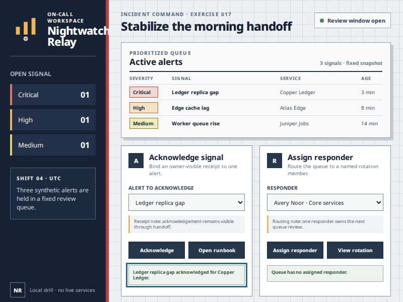
      </a>
    </td>
  </tr>
  <tr>
    <td><strong>Thread &amp; Tally</strong> — bundle action completed.</td>
    <td><strong>Nightwatch Relay</strong> — alert acknowledgement completed.</td>
  </tr>
</table>

These are real 800 × 600 Chromium captures from deterministic local fixtures. All
visible content is synthetic. They are authoring evidence marked `official: false`, not
benchmark results.

## Current result

The repository implements an executable evidence boundary and the deterministic core of
the capture and mutation pipeline. Its present scope is deliberately explicit:

| Surface                              |                                                      Current |                Pilot v0.1 target |
| ------------------------------------ | -----------------------------------------------------------: | -------------------------------: |
| Independently authored applications  |                                                   **2 / 20** |                               20 |
| Declared workflows                   |                                                   **4 / 40** |                               40 |
| Local authoring checkpoints          |                                                       **12** |      Not an official corpus unit |
| Operator definitions                 | **16 catalogued / 2 browser-executable pointer definitions** | 16 definitions across 8 families |
| Official before/after pairs          |                                                  **0 / 640** |            640 at replicate zero |
| Dataset / models / benchmark results |                                                **0 / 0 / 0** |           Future research stages |

The committed evidence bundle contains 50 exact files: 12 screenshots, their
accessibility and layout payloads, fixture/task metadata, runtime provenance, and one
canonical manifest. Its manifest SHA-256 is
`9f275968958546a51d8d502bdc125ef67c66d8fef91517d259878e571e21db56`.

There is **no released dataset, trained model, official pair, benchmark result, or
accuracy claim**. The full implemented capability inventory and qualifications live in
[docs/implementation-status.md](docs/implementation-status.md).

## Run it

The reproducibility baseline is Node.js 22.23.1 and npm 10.9.8. Build, tests, and
committed-bundle verification support Node.js 22 or newer; a fresh evidence capture is
intentionally stricter and requires exact Node.js 22.23.1 on Linux x64 with ABI 127.
Install the locked dependencies and pinned browser:

```bash
git clone https://github.com/omar07ibrahim/impactdiff.git
cd impactdiff
node --version
npm --version
npm ci
npx playwright install chromium
npm run check
npm test
```

On a fresh Linux runner, use `npx playwright install --with-deps chromium` if the
Playwright distribution packages are not already installed.

### Verify the committed evidence

These checks rebuild the TypeScript CLI, validate every bound file and current source
identity, and then verify that the README visuals still match their declared inputs:

```bash
npm run --silent evidence:pilot:check
node tools/render-pilot-workflow-gif.mjs check
node tools/render-readme-visuals.mjs check
```

The primary evidence check returns this exact path-free, LF-terminated receipt:

```text
{"official":false,"manifest_sha256":"9f275968958546a51d8d502bdc125ef67c66d8fef91517d259878e571e21db56","fixture_count":2,"workflow_count":4,"checkpoint_count":12}
```

<table>
  <tr>
    <td width="58%">
      <a href="docs/images/terminal-evidence/pilot-evidence-check.svg">
        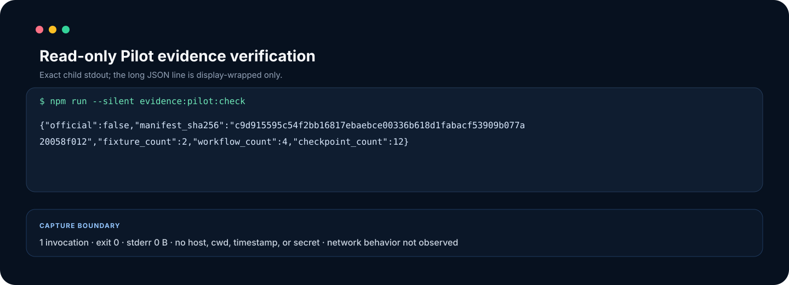
      </a>
    </td>
    <td width="42%">
      <a href="docs/images/terminal-evidence/evidence-boundary.svg">
        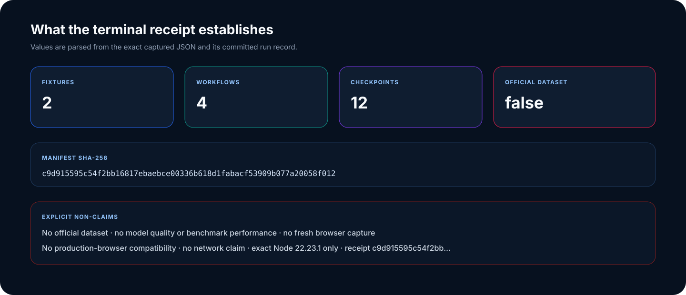
      </a>
    </td>
  </tr>
  <tr>
    <td><strong>Recorded terminal run.</strong> At the recorded commit, one exact Node.js 22.23.1 invocation exited 0, wrote the receipt above to stdout, and wrote zero stderr bytes. The output is <code>official: false</code> and is not independently authenticated.</td>
    <td><strong>Recorded claim boundary.</strong> The receipt verifies 2 fixtures, 4 workflows, and 12 checkpoints. Network behavior was not observed; no fresh browser capture or browser-suite rerun is claimed.</td>
  </tr>
</table>

The committed [raw transcript](docs/images/terminal-evidence/pilot-evidence-check.txt)
and [terminal-evidence manifest](docs/images/terminal-evidence/MANIFEST.json) bind the
command, runtime, source revision and tree, ten allowlisted source byte identities,
stdout, and both SVGs. The manifest records one invocation and
`network_observation: "not_observed"`; it does not claim network isolation. This run
establishes one successful exact-runtime verification of the committed local-authoring
bundle at its recorded commit. The output is commit-bound, `official: false`, and not
independently authenticated. It is not a fresh browser capture or browser-suite rerun,
official dataset release, model result, benchmark result, production-browser
compatibility result, or claim about another runtime.

To capture a fresh bundle, use exact Node.js 22.23.1 on Linux x64 with ABI 127, start
from a clean worktree, create a private parent, and choose an absent final leaf. The
capture command refuses an existing destination:

```bash
install -d -m 0700 ../impactdiff-evidence-output
npm run evidence:pilot -- capture --repository . --output ../impactdiff-evidence-output/pilot-evidence
npm run evidence:pilot -- check --repository . --output ../impactdiff-evidence-output/pilot-evidence
```

The committed bundle can be inspected directly in
[`docs/images/pilot-portfolio-evidence/`](docs/images/pilot-portfolio-evidence/MANIFEST.json).

## One workflow, replayed

<p align="center">
  <a href="docs/images/pilot-workflow-demo/incident-command--acknowledge-alert.gif">
    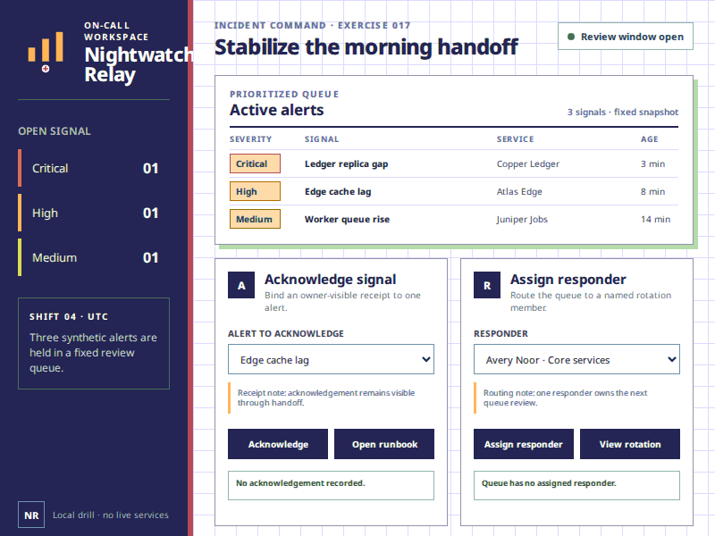
  </a>
</p>

This GIF is a deterministic replay of three real committed Chromium checkpoints, not a
new screen recording. It preserves the original 800 × 600 frames with no scaling or
caption overlay, then applies one documented fixed RGB332 palette. The
[replay manifest](docs/images/pilot-workflow-demo/MANIFEST.json) binds the checkpoint
IDs, source PNG byte identities, frame delays, generator commit, locked dependency
identities, and final GIF SHA-256
`04517d956daffa7187d93ac3c847af5d7cc060be972240d721173c41e3c9f97e`.

The replay is `official: false` and establishes sequencing and byte reproducibility
only. It is not a fresh browser run, model result, benchmark, or production-browser
claim. Re-run its read-only verifier with exact Node.js 22.23.1 on Linux x64:

```bash
node tools/render-pilot-workflow-gif.mjs check
```

## Real workflow captures

Each triptych is one manifest-bound local authoring replay. The three images are the
canonical `initial_state`, `pre_primary_action`, and `post_primary_action` checkpoints;
the corresponding accessibility-tree and bounded layout-graph JSON files sit beside each
PNG.

### Thread & Tally · Add bundle

|                                                                                               `initial_state`                                                                                                |                                                                                                              `pre_primary_action`                                                                                                              |                                                                                                        `post_primary_action`                                                                                                        |
| :----------------------------------------------------------------------------------------------------------------------------------------------------------------------------------------------------------: | :--------------------------------------------------------------------------------------------------------------------------------------------------------------------------------------------------------------------------------------------: | :---------------------------------------------------------------------------------------------------------------------------------------------------------------------------------------------------------------------------------: |
| [](docs/images/pilot-portfolio-evidence/market-basket--add-bundle--initial-state.png) | [](docs/images/pilot-portfolio-evidence/market-basket--add-bundle--pre-primary-action.png) | [](docs/images/pilot-portfolio-evidence/market-basket--add-bundle--post-primary-action.png) |

The deterministic action selects the bundle target and performs the authored coordinate
click; the final checkpoint contains the fixture's visible success receipt.

### Thread & Tally · Choose pickup

|                                                                                                    `initial_state`                                                                                                    |                                                                                                                  `pre_primary_action`                                                                                                                   |                                                                                                            `post_primary_action`                                                                                                             |
| :-------------------------------------------------------------------------------------------------------------------------------------------------------------------------------------------------------------------: | :-----------------------------------------------------------------------------------------------------------------------------------------------------------------------------------------------------------------------------------------------------: | :------------------------------------------------------------------------------------------------------------------------------------------------------------------------------------------------------------------------------------------: |
| [](docs/images/pilot-portfolio-evidence/market-basket--choose-pickup--initial-state.png) | [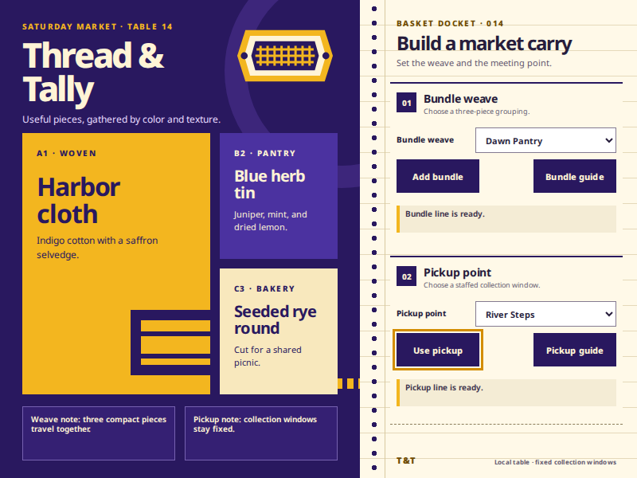](docs/images/pilot-portfolio-evidence/market-basket--choose-pickup--pre-primary-action.png) | [](docs/images/pilot-portfolio-evidence/market-basket--choose-pickup--post-primary-action.png) |

The same fixture is replayed with an independent ActionPlan for its pickup task.

### Nightwatch Relay · Acknowledge alert

|                                                                                                             `initial_state`                                                                                                             |                                                                                                                           `pre_primary_action`                                                                                                                            |                                                                                                                     `post_primary_action`                                                                                                                      |
| :-------------------------------------------------------------------------------------------------------------------------------------------------------------------------------------------------------------------------------------: | :-----------------------------------------------------------------------------------------------------------------------------------------------------------------------------------------------------------------------------------------------------------------------: | :------------------------------------------------------------------------------------------------------------------------------------------------------------------------------------------------------------------------------------------------------------: |
| [](docs/images/pilot-portfolio-evidence/incident-command--acknowledge-alert--initial-state.png) | [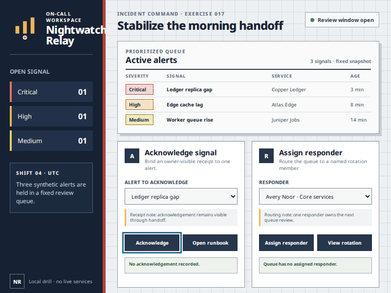](docs/images/pilot-portfolio-evidence/incident-command--acknowledge-alert--pre-primary-action.png) | [](docs/images/pilot-portfolio-evidence/incident-command--acknowledge-alert--post-primary-action.png) |

The post-action checkpoint shows the authored acknowledgement receipt for the selected
synthetic alert.

### Nightwatch Relay · Assign responder

|                                                                                                           `initial_state`                                                                                                            |                                                                                                                          `pre_primary_action`                                                                                                                          |                                                                                                                    `post_primary_action`                                                                                                                    |
| :----------------------------------------------------------------------------------------------------------------------------------------------------------------------------------------------------------------------------------: | :--------------------------------------------------------------------------------------------------------------------------------------------------------------------------------------------------------------------------------------------------------------------: | :---------------------------------------------------------------------------------------------------------------------------------------------------------------------------------------------------------------------------------------------------------: |
| [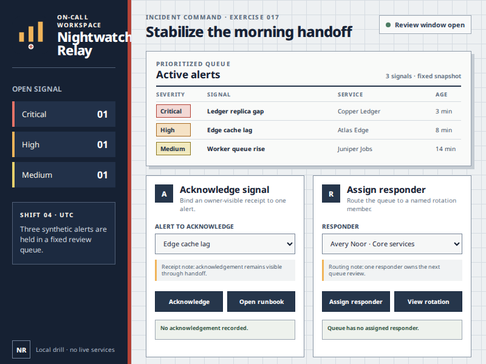](docs/images/pilot-portfolio-evidence/incident-command--assign-responder--initial-state.png) | [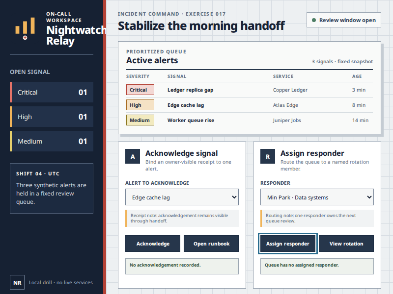](docs/images/pilot-portfolio-evidence/incident-command--assign-responder--pre-primary-action.png) | [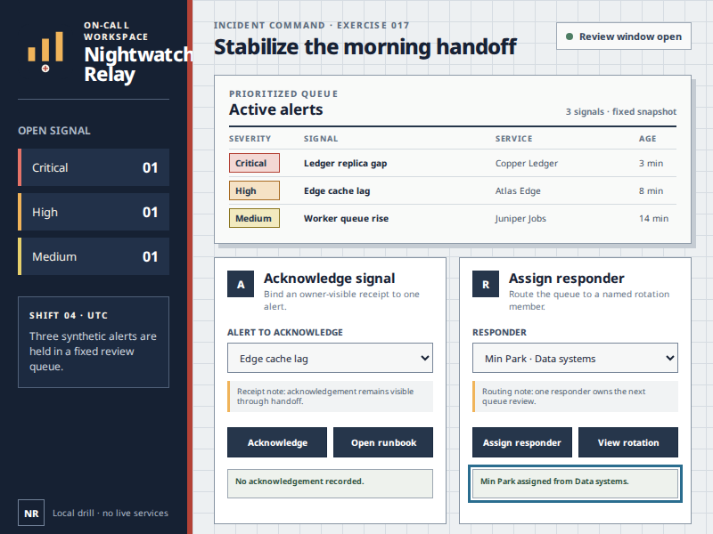](docs/images/pilot-portfolio-evidence/incident-command--assign-responder--post-primary-action.png) |

This ActionPlan exercises the fixture's separate responder-assignment task in a fresh
browser context.

## Key capabilities

- Strict canonical contracts bind screenshots, accessibility trees, layout graphs,
  action plans, source state, mutation provenance, and visible/sealed dataset records.
- Runtime-owned Chromium replay pins browser, Playwright, fonts, locale, viewport, time,
  animation, and network policy, then audits lifecycle closure and exact cleanup.
- Reversible mutation authoring currently executes both catalogued pointer definitions
  across all four authored workflows in fresh baseline and candidate contexts.
- Content-addressed storage and resolved-record replay reject missing, extra,
  non-canonical, or semantically inconsistent artifacts.
- Manifest-last, same-parent publication makes verified evidence and paired development
  releases visible atomically.

## What the evidence says

The labels below describe how each SVG is produced:

- **Source-derived** — rendered from tracked contracts, catalogs, and implementation
  source.
- **Captured** — computed from manifest-bound evidence or recorded run artifacts.
- **Mixed** — combines captured evidence with source-backed verification metadata.

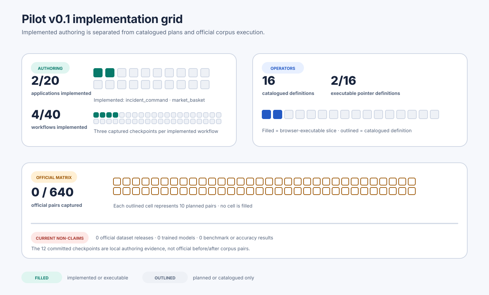

**Source-derived — Pilot v0.1 implementation coverage.** Exactly 2 of 20 applications
and 4 of 40 workflows have local authoring packages; all 16 operator definitions are
catalogued, while 2 pointer definitions are browser-executable. The 12 checkpoints are
not official corpus pairs.

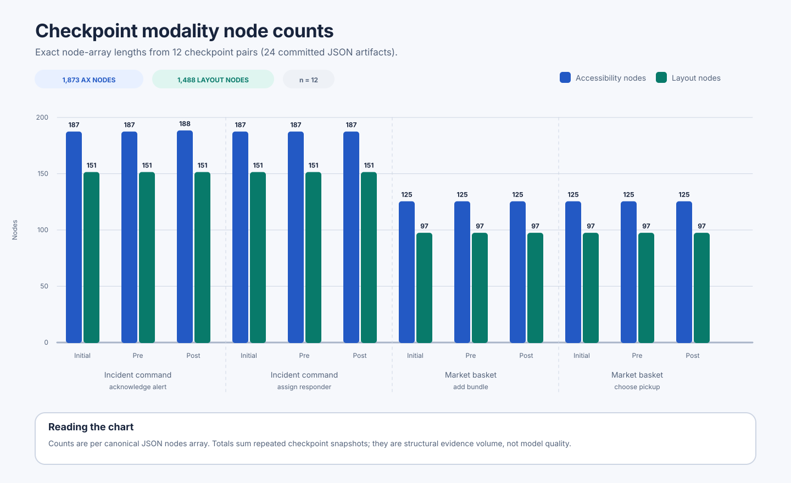

**Captured — accessibility and layout nodes by checkpoint.** Counts come from 24
committed canonical JSON payloads across 12 checkpoints. They describe structural
evidence volume, not model quality.

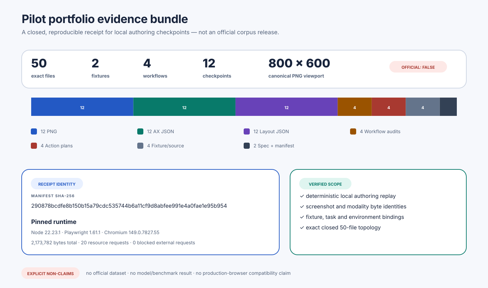

**Captured — Pilot portfolio evidence receipt.** This summarizes the exact 50-file
bundle, captured runtime identity, and explicit `official: false` boundary.

## Architecture and trust boundary

The implemented Pilot path is deliberately narrower than the planned research pipeline:

1. Two manifest-bound fixture packages expose four closed ActionPlans and audited source
   bytes.
2. The exact-runtime capture path replays each workflow in a fresh Chromium context and
   withholds all three checkpoints until the success oracle and owned lifecycle close.
3. The portfolio assembler accepts only the fixed 2-fixture/4-workflow matrix, binds
   each PNG, accessibility tree, layout graph, audit, fixture identity, action plan, and
   capture environment, and produces 49 data artifacts plus one canonical manifest.
4. Publication writes into an owned same-parent stage, writes the manifest last,
   verifies the complete stage, and exposes it with one rename.
5. The read-only repository verifier checks exact membership, byte identities, codecs,
   cross-modal graph bindings, and freshness of the current scoped source before it
   emits the five-field receipt shown above.

The [source-level Pilot evidence architecture tour](docs/pilot-evidence-architecture.md)
maps each boundary to its implementation and distinguishes browser capture, committed
bundle verification, and recorded terminal evidence.

The planned benchmark input is a matched before/after capture containing screenshots,
accessibility trees, bounded layout graphs, and a fixed action plan. Pilot v0.1 narrows
the future learned task to a calibrated binary task-regression score. Ordinal severity
and learned localization remain later research questions, not promised outputs.

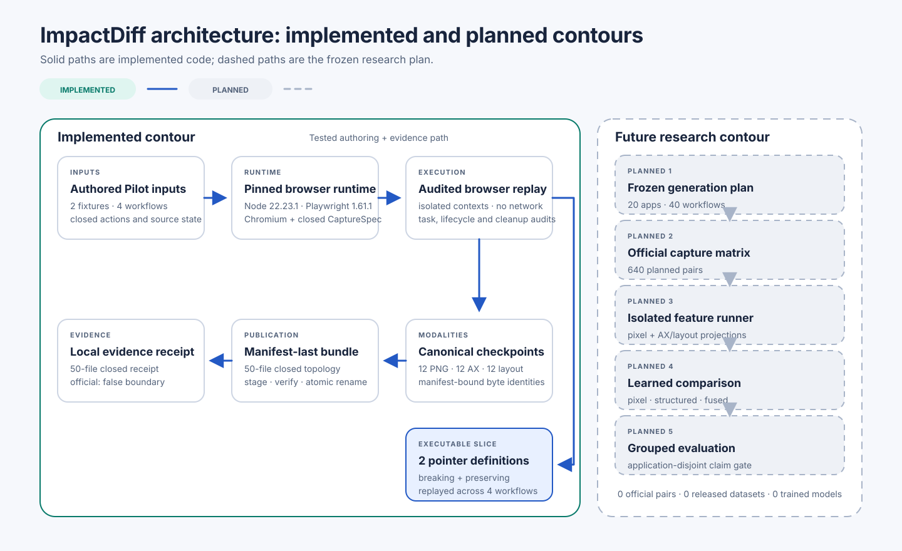

**Source-derived — implemented and planned architecture.** Solid connections are
implemented and tested; dashed connections are the remaining research pipeline, not a
claim about shipped data or models.

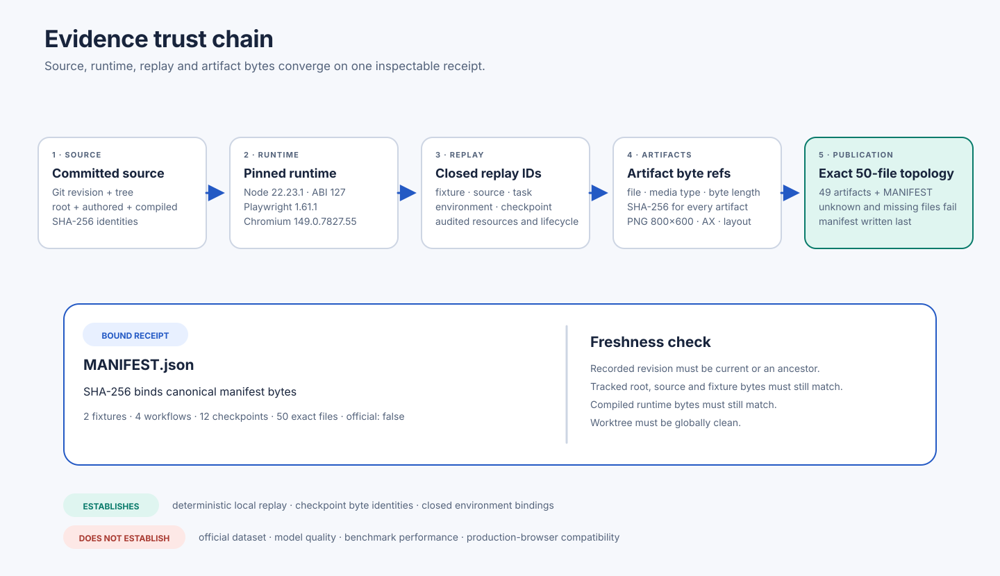

**Source-derived — evidence trust chain.** The manifest binds the Git revision and tree,
selected root files, authored and compiled trees, Node/Playwright/Chromium identities,
fixture and task identities, and every checkpoint byte identity. Repository-aware
verification also enforces freshness against the current checkout.

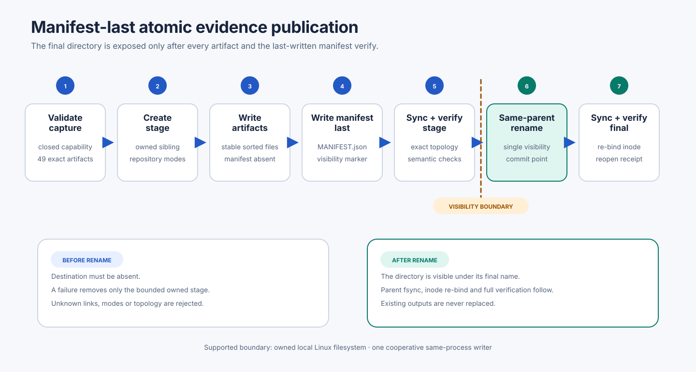

**Source-derived — manifest-last atomic publication.** Capture is validated before
staging; artifacts are written before the manifest; exact topology and semantics are
verified before and after one same-parent rename.

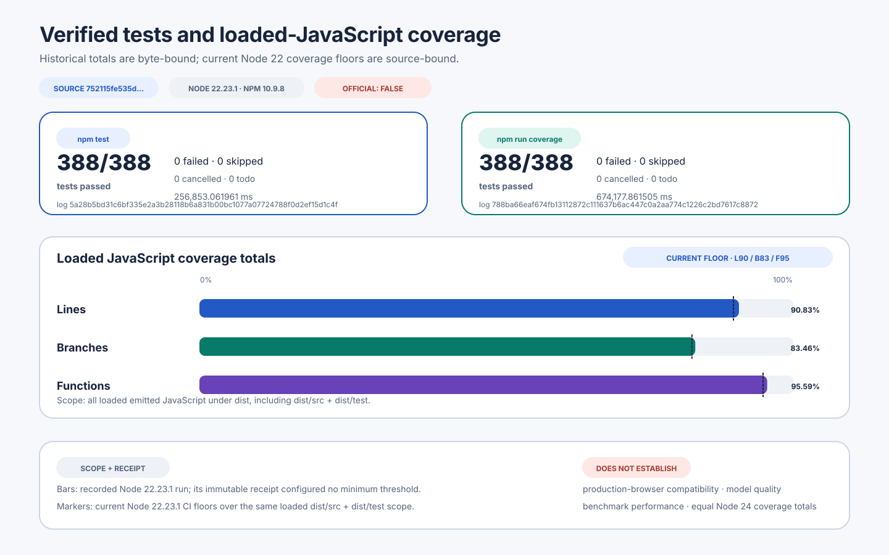

**Mixed — scoped quality verification.** The recorded run passes 415 of 415 TAP test
points (344 top-level and 71 nested) and reports 90.17% line, 83.15% branch, and 95.26%
function coverage across loaded emitted JavaScript under `dist`, including
`dist/src + dist/test`. Chromium page JavaScript, non-JavaScript assets, and unloaded
modules are outside that coverage scope. The recorded `npm run coverage:check` command
and current CI both enforce 90% line, 83% branch, and 95% function floors on exact Node
22.23.1 over that same scope. Node 24 runs the ordinary test suite as a compatibility
check; equal coverage totals across Node majors are not claimed. This is verification
evidence, not a broad quality or performance claim.

### Hard technical decisions

- **Outcome before label:** executable task state derives the measured outcome; an
  operator's declared task relation remains provenance, not a trusted label.
- **Visible/sealed separation:** model-visible evidence and mutation/outcome metadata
  use disjoint content-addressed roots and are replayed before publication.
- **Canonical modalities:** bounded PNG decoding, deterministic RGBA re-encoding,
  normalized accessibility trees, and Q64 layout geometry remove incidental variance.
- **Closed runtime identity:** CaptureSpec bytes bind browser, Playwright, launch
  profile, fonts, viewport, locale, time, animation, and network policy.
- **Failure-atomic final output:** incomplete capture and cleanup failures expose no
  partial final result; append-only releases become visible only after semantic
  verification.

The detailed implementation claims and qualifications are kept in the
[implementation status](docs/implementation-status.md).

## Research question and evaluation plan

On application-disjoint synthetic workflows, can a model combining pixel and structured
accessibility/layout evidence detect task-breaking changes better than learned unimodal
baselines? The comparison is supported only when the lower bound of a paired 95%
application-cluster bootstrap interval for each average-precision difference is above
zero.

Pilot v0.1 freezes 20 separately designed local mini-applications, two workflows per
application, eight causal mutation families, matched task-breaking and task-preserving
variants, and exactly 640 planned pairs at replicate zero. Four predeclared
five-application blocks rotate through grouped outer folds; each fold uses 10/5/5
training, validation, and test applications, and every application contributes
outer-test predictions exactly once. Average precision is primary; AUROC, recall at a 5%
benign false-positive rate, Brier score, calibration error, per-group results, and
resource cost are supporting measurements. Family and joint slices are diagnostics, not
claim-eligible holdouts in v0.1.

Each future benchmark item is intended to contain:

- fixed-environment before and after screenshots;
- normalized accessibility snapshots;
- a bounded graph of visible DOM nodes and layout relations;
- a deterministic action plan shared by both captures;
- content hashes and capture-environment provenance; and
- separately sealed traces, oracle results, mutation provenance, and labels.

The compiler starts with a benign, contrast-checked palette swap and a pointer
interceptor expected to break the primary click task. A larger mutation set is planned
for occlusion, clipping, focus order, accessible names, responsive collapse, safe
reflow, copy edits, and other controlled changes.

## Documentation

- [Research charter](docs/charter.md) — hypotheses, metrics, falsification criteria, and
  non-goals.
- [Pilot v0.1 protocol](docs/pilot-v0.1-protocol.md) — frozen corpus matrix, split,
  metric hierarchy, claim gate, and explicit non-claims.
- [Pilot application catalog](docs/pilot-v0.1-application-catalog.md) — the 20 planned
  application keys and 40 workflows.
- [Pilot mutation operators](docs/pilot-v0.1-mutation-operators.md) — the closed
  operator-definition catalog and causal policy.
- [Data-boundary contract](docs/data-boundary.md) — model-visible evidence versus sealed
  outcome and mutation metadata.
- [Contract invariants](docs/contract-invariants.md) — canonical payloads, resolved
  artifact checks, and artifact-store threat boundary.
- [Fresh-pair generation](docs/fresh-pair-generation.md) — lifecycle closure,
  development label policy, and non-claims.
- [Paired publication](docs/paired-publication.md) — commit point, recovery rules, and
  unsupported filesystem adversaries.
- [Pilot evidence architecture](docs/pilot-evidence-architecture.md) — the implemented
  fixture-to-checkpoint path, publication boundary, repository verifier, and terminal
  evidence layer.
- [Market-basket authoring](docs/pilot-v0.1-market-basket-authoring.md) and
  [incident-command authoring](docs/pilot-v0.1-incident-command-authoring.md) — exact
  fixture/task identities, deterministic replay, predicates, and current pointer slice.
- [Implementation status](docs/implementation-status.md) — complete implemented
  capability inventory and scope qualifications.

## Repository map

- `src/contracts/` — visible/sealed manifests, identities, resolved bundles, and dataset
  validation.
- `src/artifacts/` — canonical PNG handling and the registered-codec artifact store.
- `src/capture/` — capture schemas, validators, normalizers, and fixture target
  identities.
- `src/mutations/` — operator catalog, mutation compiler, and verified Chromium runtime.
- `src/generation/` — fresh-pair orchestration, pair derivation, and resolved replay.
- `src/sealed/` — oracle, trace, changed-surface, and localization contracts.
- `src/publication/` — atomic paired publication, recovery, and reopen verification.
- `src/benchmark/` — machine-validated Pilot v0.1 protocol and application catalog.
- `src/pilot/` — fixture manifests, source identities, authoring replay, checkpoint
  capture, and pointer-pair authoring.
- `src/portfolio-evidence/` — source/runtime identity, capture, atomic publication, and
  repository-aware verification for this README's evidence.
- `src/cli/` — bounded development-release and portfolio-evidence commands.
- `fixtures/` — the checkout development fixture and two independently authored Pilot
  applications.
- `docs/images/terminal-evidence/` — one manifest-bound read-only verification
  transcript and its two generated explanatory SVGs.
- `tools/render-readme-visuals.mjs` — deterministic, network-free README visual
  generation and verification.

The checkout fixture vendors the Latin variable WOFF2 from
`@fontsource-variable/noto-sans@5.2.10`. Noto Sans remains licensed under the SIL Open
Font License 1.1; its [bundled license](fixtures/checkout-card-v1/fonts/OFL-1.1.txt)
stays beside the font.

## Development commands

```bash
npm run format:check
npm run check
npm test
npm run coverage
npm run coverage:check
npm run --silent evidence:pilot:check
node tools/render-readme-visuals.mjs check
```

To build one real pointer-interceptor development release, provide a pre-existing
private root. Generated releases are intentionally ignored by Git:

```bash
install -d -m 0700 artifacts/generated/dev-pointer-v1
npm run --silent release:dev -- --root artifacts/generated/dev-pointer-v1
```

Success prints one JSON receipt. The command fixes the operator to `pointer_interceptor`
and replicate index to `0`; the public TypeScript API also supports the `palette_swap`
development case.

Engineering constraints: capture runs without paid APIs; browser, fonts, locale,
viewport, timezone, animation, and time are pinned or recorded; supported artifacts are
content-addressed, codec-canonical, and independently verifiable; future
development-scale training is constrained by the frozen plan to a CPU-capable budget;
and evidence and labels come from executable state checks, not free-form model
judgments.

## License

Apache-2.0. See [LICENSE](LICENSE).
