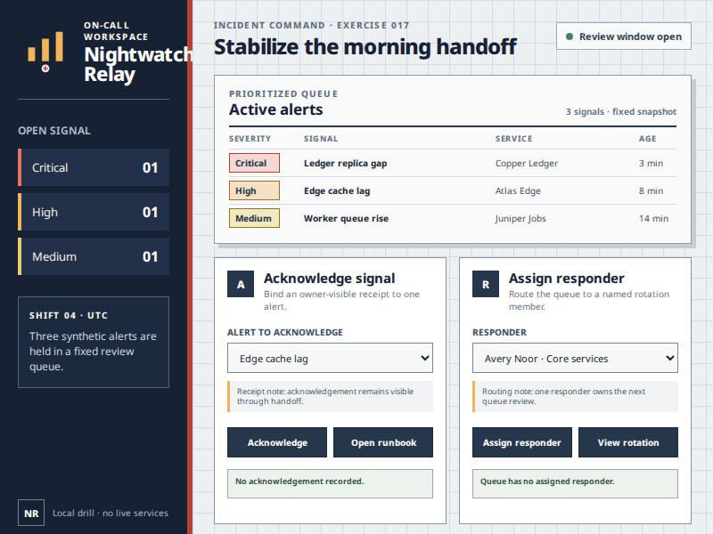

# Pilot v0.1 Incident Command authoring package

`pilot-incident-command-v1` is the second independently authored application package for
the ImpactDiff Pilot. Revision `pilot-incident-command-v1.0.0-authoring.1` is a mutable,
`official: false` pre-release used to test whether the existing package, capture,
predicate, and pointer runtimes generalize beyond the first market-board application.

It is not a dataset row or benchmark result. No run described here creates a
`capture_id`, official outcome, regression label, generation-plan cell, model feature,
prediction, or accuracy claim.

## Application

Nightwatch Relay is a synthetic 800 by 600 incident-command console. Its severity rail,
dense alert ledger, action cards, copy, JSON events, and SVG glyph are
application-owned. It shares only the exact allowlisted Noto Sans and OFL bytes with the
other fixtures.



The checked-in image is an initial-state authoring screenshot, not a corpus sample. It
is included so a reviewer can inspect the application without running Chromium.

The package declares two four-action workflows:

- `acknowledge_alert` moves the native alert selection from `edge-cache-lag` to
  `ledger-replica-gap`, tabs to **Acknowledge**, clicks its source-bound center, and
  finishes with `Ledger replica gap acknowledged for Copper Ledger.`
- `assign_responder` moves the native responder selection from `avery-noor` to
  `min-park`, tabs to **Assign responder**, clicks its source-bound center, and finishes
  with `Min Park assigned from Data systems.`

Both action plans are exactly `focus`, `ArrowDown`, `Tab`, and one pointer click. Their
checkpoint boundaries are `[-1, 2, 3]`: initial state, immediately before the primary
action, and immediately after it.

## Closed source and task identities

The raw canonical manifest binds seven resources, including the two shared font/license
resources. Its SHA-256 is
`5455f0881475c4a9db92a364f7aea7e5dfe2ae670ff819b97b50a3c1f21ecce5`. The package loader
derives, rather than accepts, the downstream identities:

| Artifact                 | Content-derived identity                                                 |
| ------------------------ | ------------------------------------------------------------------------ |
| SourceState              | `idss1_5de36eaaeb9774c8ff5d68f2e48ffa9eedc2b5043f480286197011a63dca49f6` |
| `acknowledge_alert` task | `idtk1_f30e42e674b6429551d797fb11dad55cb0ddaec07d80ccc8dbba8c352d2542e2` |
| `assign_responder` task  | `idtk1_24cee5532e154c630c54aa376ff95fb8507179fb18c57dd2182ceb263743e747` |

Changing any application byte rotates the manifest digest, SourceState, ActionPlans,
action-target identities, and task identities. The authoring manifest contains none of
those derived IDs, so the identity graph remains acyclic.

Package tests also compare application-owned raw digests with both the market-basket and
checkout fixtures. Only the two allowlisted shared digests intersect. Five-token HTML,
CSS, and JavaScript shingle comparisons remain below the frozen per-language and
aggregate review thresholds.

## Existing-runtime generalization

The application was admitted without an `incident_command` branch or selector in `src/`.
The existing logical ABI resolves these slots separately for each workflow:

`root`, `setup`, `focus_entry`, `primary`, `native_control_peer`, `clip_host`,
`displacement_anchor`, `content_pressure`, and `success`.

The browser checks establish the following for both workflows:

- two exact success-only baseline replays under one reusable verified environment;
- three fresh-context capture attempts with byte-identical PNG, accessibility-tree, and
  layout-graph payloads at every corresponding checkpoint;
- one action-target binding in every layout graph and three distinct boundary
  observations per workflow;
- an all-pass ordered source vector for `P, O, D, N, F, A, C, V`;
- exact fixture-resource request counts, no external requests, and no unexpected local
  requests; and
- zero owned browser contexts after every attempt.

The primary buttons deliberately use integer source geometry. The first pointer
authoring check exposed fractional grid geometry and hover-state drift; the fixture was
corrected before the identities above were recorded. The runtime was not weakened to
accept ambiguous geometry or an inexact outcome.

## Pointer-definition matrix

The existing pointer-authoring API was then run for both exact catalog definitions.
Every case is repeated three times in fresh baseline and candidate contexts:

| Workflow            | Definition                                      | Baseline        | Candidate         | Exact attempts |
| ------------------- | ----------------------------------------------- | --------------- | ----------------- | -------------: |
| `acknowledge_alert` | `pointer_hit_testing.intercept_source_point.v1` | `exact_success` | `exact_unchanged` |              3 |
| `acknowledge_alert` | `pointer_hit_testing.pass_source_point.v1`      | `exact_success` | `exact_success`   |              3 |
| `assign_responder`  | `pointer_hit_testing.intercept_source_point.v1` | `exact_success` | `exact_unchanged` |              3 |
| `assign_responder`  | `pointer_hit_testing.pass_source_point.v1`      | `exact_success` | `exact_success`   |              3 |

For each candidate, the runtime applies the authenticated definition, measures the
installed eight-predicate policy, removes it, proves the fixed inverse audit, applies it
again for the unchanged action plan, and proves final cleanup. DOM, relevant computed
styles, pixels, accessibility, layout, hit testing, focus and scroll, listener
registrations, owned handles, and runtime cleanliness are checked before the result is
released.

The public result remains a deeply frozen JSON receipt containing only the definition
key, baseline and candidate audits, and their independently measured task outcomes.
Checkpoint bytes, local probes, declared relations, operator IDs, labels, generation
fields, and browser capabilities remain private.

## Reproduction

After installing the locked Node dependencies and pinned Chromium:

```bash
npm run format:check
npm run check
npm run build
node --test --test-concurrency=1 \
  dist/test/pilot/incident-command-fixture.test.js \
  dist/test/pilot/incident-command-runtime.test.js \
  dist/test/pilot/incident-command-pointer-authoring.test.js
```

The full `npm test` command runs these checks together with the existing repository
suite.

## Remaining boundary

This milestone moves the mutable authoring surface from one application and two
workflows to two applications and four workflows. Only two of the 16 Pilot definitions
are executable, and none of the 640 planned cells is official. Eighteen applications, 14
operator definitions, full-catalog audits, the resolved immutable generation plan,
dataset publication, isolated feature extraction, training, sealed prediction, and
independent scoring remain before any Pilot benchmark claim is eligible.
